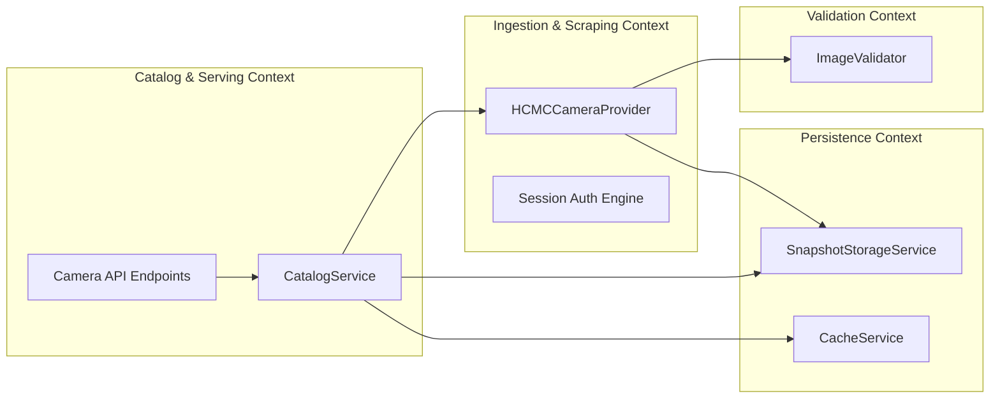

# FloodWheel — Bounded Context Map

## Context Relationships

```mermaid
graph LR
    subgraph "Ingestion & Scraping Context"
        HCMC[HCMCCameraProvider]
        Auth[Session Auth Engine]
    end

    subgraph "Validation Context"
        Val[ImageValidator]
    end

    subgraph "Persistence Context"
        Store[SnapshotStorageService]
        Redis[CacheService]
    end

    subgraph "Catalog & Serving Context"
        Cat[CatalogService]
        API[Camera API Endpoints]
    end

    HCMC --> Val
    HCMC --> Store
    Cat --> Store
    Cat --> Redis
    Cat --> HCMC
    API --> Cat
```
