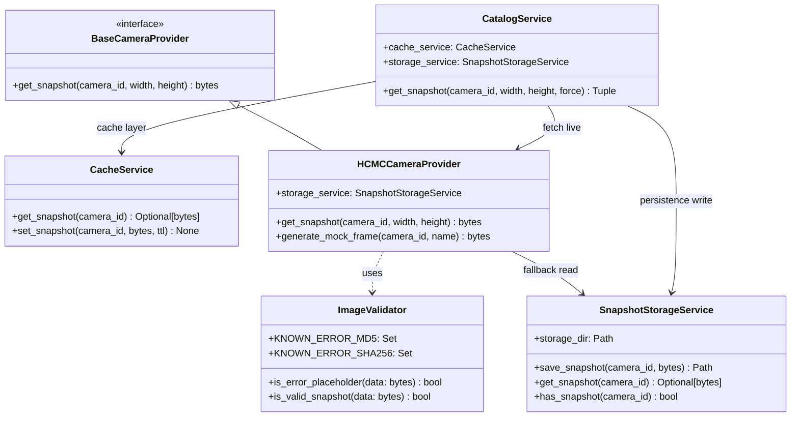

# FloodWheel — Application Design: Services

## Service Architecture

```mermaid
classDiagram
    class ImageValidator {
        +KNOWN_ERROR_MD5: Set
        +KNOWN_ERROR_SHA256: Set
        +is_error_placeholder(data: bytes) bool
        +is_valid_snapshot(data: bytes) bool
    }

    class SnapshotStorageService {
        +storage_dir: Path
        +save_snapshot(camera_id, bytes) Path
        +get_snapshot(camera_id) Optional[bytes]
        +has_snapshot(camera_id) bool
    }

    class CacheService {
        +get_snapshot(camera_id) Optional[bytes]
        +set_snapshot(camera_id, bytes, ttl) None
    }

    class BaseCameraProvider {
        <<interface>>
        +get_snapshot(camera_id, width, height) bytes
    }

    class HCMCCameraProvider {
        +storage_service: SnapshotStorageService
        +get_snapshot(camera_id, width, height) bytes
        +generate_mock_frame(camera_id, name) bytes
    }

    class CatalogService {
        +cache_service: CacheService
        +storage_service: SnapshotStorageService
        +get_snapshot(camera_id, width, height, force) Tuple
    }

    BaseCameraProvider <|-- HCMCCameraProvider
    HCMCCameraProvider ..> ImageValidator : uses
    HCMCCameraProvider --> SnapshotStorageService : fallback read
    CatalogService --> CacheService : cache layer
    CatalogService --> SnapshotStorageService : persistence write
    CatalogService --> HCMCCameraProvider : fetch live
```
