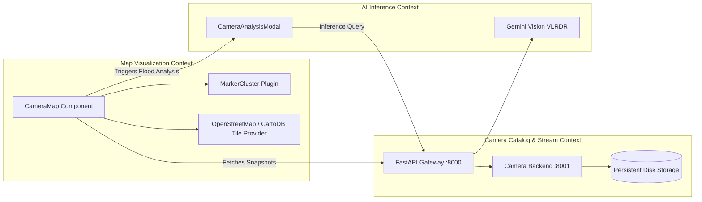

# FloodWheel — Bounded Context Map: Camera Map Layer

```mermaid
graph LR
    subgraph "Map Visualization Context"
        CM[CameraMap Component]
        Cluster[MarkerCluster Plugin]
        Tiles[OpenStreetMap / CartoDB Tile Provider]
    end

    subgraph "Camera Catalog & Stream Context"
        API[FastAPI Gateway :8000]
        CB[Camera Backend :8001]
        Snapshots[(Persistent Disk Storage)]
    end

    subgraph "AI Inference Context"
        Gemini[Gemini Vision VLRDR]
        Modal[CameraAnalysisModal]
    end

    CM --> Cluster
    CM --> Tiles
    CM -->|Fetches Snapshots| API
    API --> CB
    CB --> Snapshots
    CM -->|Triggers Flood Analysis| Modal
    Modal -->|Inference Query| API
    API --> Gemini
```
