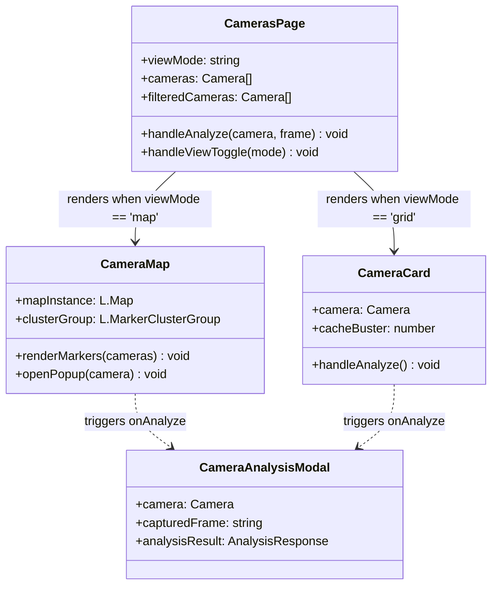

# FloodWheel — Application Design: Services

```mermaid
classDiagram
    class CamerasPage {
        +viewMode: string
        +cameras: Camera[]
        +filteredCameras: Camera[]
        +handleAnalyze(camera, frame) void
        +handleViewToggle(mode) void
    }

    class CameraMap {
        +mapInstance: L.Map
        +clusterGroup: L.MarkerClusterGroup
        +renderMarkers(cameras) void
        +openPopup(camera) void
    }

    class CameraCard {
        +camera: Camera
        +cacheBuster: number
        +handleAnalyze() void
    }

    class CameraAnalysisModal {
        +camera: Camera
        +capturedFrame: string
        +analysisResult: AnalysisResponse
    }

    CamerasPage --> CameraMap : renders when viewMode == 'map'
    CamerasPage --> CameraCard : renders when viewMode == 'grid'
    CameraMap ..> CameraAnalysisModal : triggers onAnalyze
    CameraCard ..> CameraAnalysisModal : triggers onAnalyze
```
