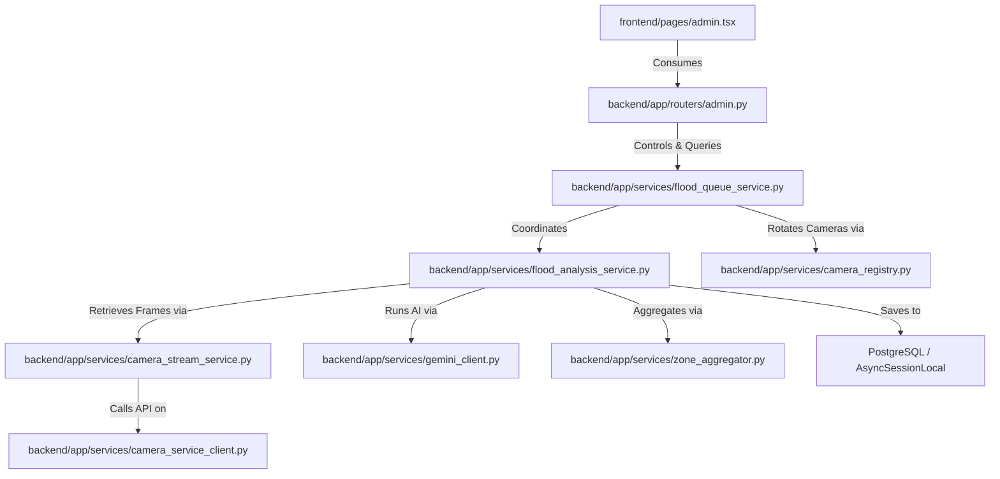

# Component Dependency — Automated 30-Minute AI Analysis & Admin Monitor

```mermaid
graph TD
    AdminPage["frontend/pages/admin.tsx"] -->|Consumes| AdminRouter["backend/app/routers/admin.py"]
    AdminRouter -->|Controls & Queries| FloodAnalysisQueue["backend/app/services/flood_queue_service.py"]
    FloodAnalysisQueue -->|Coordinates| FloodAnalysisService["backend/app/services/flood_analysis_service.py"]
    FloodAnalysisQueue -->|Rotates Cameras via| CameraRegistry["backend/app/services/camera_registry.py"]
    FloodAnalysisService -->|Retrieves Frames via| CameraStreamService["backend/app/services/camera_stream_service.py"]
    CameraStreamService -->|Calls API on| CameraServiceClient["backend/app/services/camera_service_client.py"]
    FloodAnalysisService -->|Runs AI via| GeminiClient["backend/app/services/gemini_client.py"]
    FloodAnalysisService -->|Aggregates via| ZoneAggregator["backend/app/services/zone_aggregator.py"]
    FloodAnalysisService -->|Saves to| DB["PostgreSQL / AsyncSessionLocal"]
```
